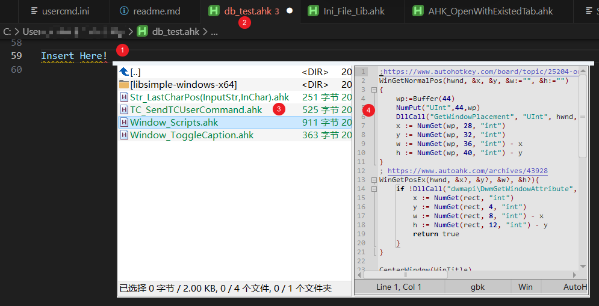

# TC_SnippetManager #

>Total Commander (TC) Snippet Manager streamlines coding / development

## Usage ##

1. Configure the directory where the TC is located and the directory corresponding to the program `fragmentsetting.ini`
2. Press the shortcut `{F1}` to experience it. Users can modify the shortcut keys by themselves.

## Features ##

- *Automatic Position Determination*: The pop-up TC window will appear at the position A where the editing cursor is located.
- *Automatic language determination*: Based on the language type currently edited, you can jump to the corresponding fragment directory.
- *VS Code-compatible*: If you edit an `.ahk` file in VSC and press a shortcut key, you will be redirected to the `ahk_lib`. Users can configure the [fragment directory] corresponding to other languages in `setting.ini`
- *Simple interface*: the pop-up TC window has only two columns [Pop-up Status], the left side is the filter area, and the right side is the preview area. The interface is minimalist, with no title bar, menu bar, etc.
- *Powerful performance*: Make full use of the advantages of TC to preview clips through quick search for key positioning and preview capabilities. Positioning is fast! Preview ability!
- Theoretically, the Snippet Manager (TC Manager's syntax highlighting and text previewer) should support other programming languages, not *only* AutoHotkey.
- *One-click Paste*: Select the file containing the target fragment under [Pop-up Status], and press the `{Enter}` key to paste the content of the file into position A.
- *Silent Exit*: The TC window in [Pop-up Status] will wait for the `{Enter}` key to be pressed or the TC window loses focus before exiting.
- *Force Exit*: Double-click the ESC in [Pop-up Status] to exit [Pop-up Status].
Mode switching: Switch the TC from [Pop-up Status] to [normal mode], and directly run the directory.`\lib\TC_ToggleMode.ahk`
